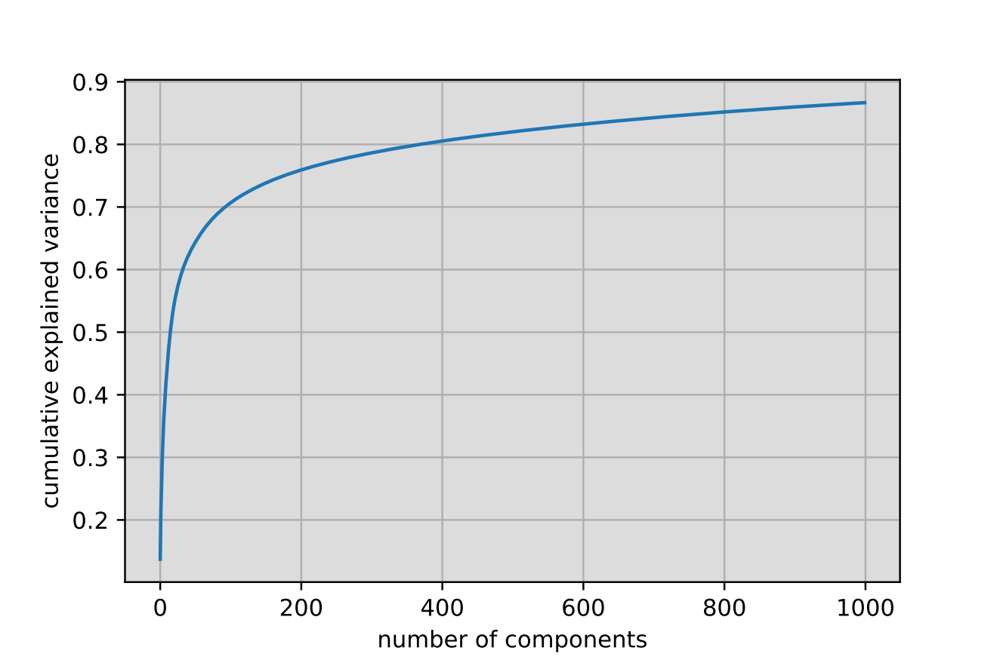
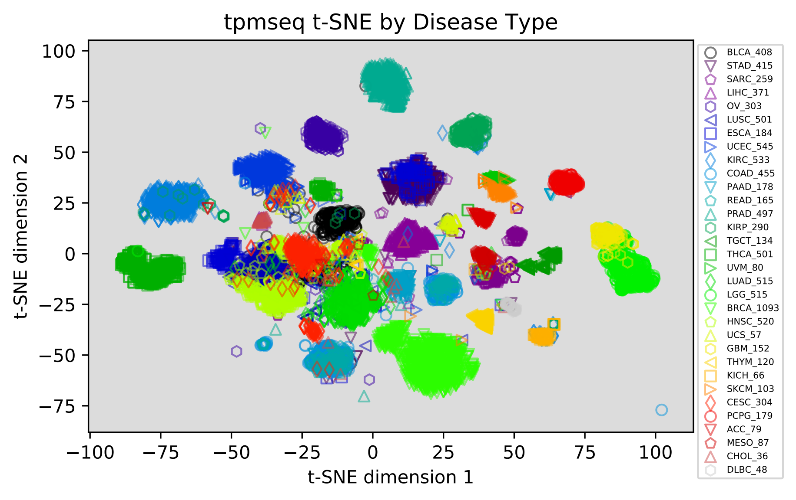
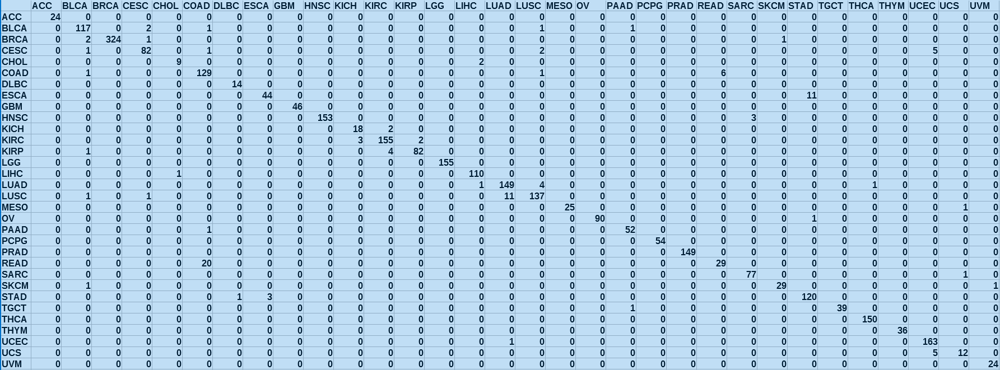
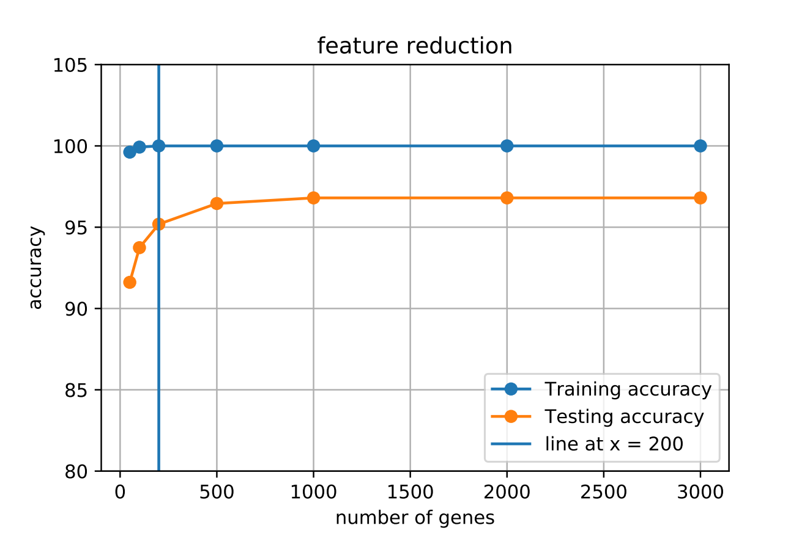
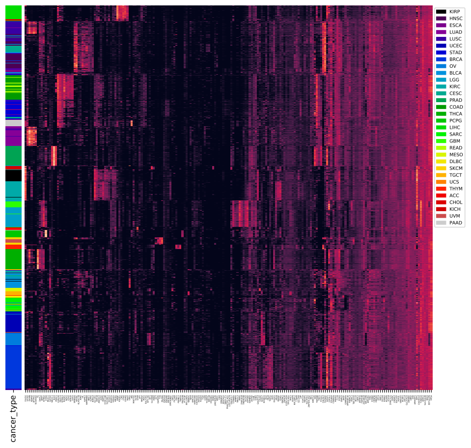
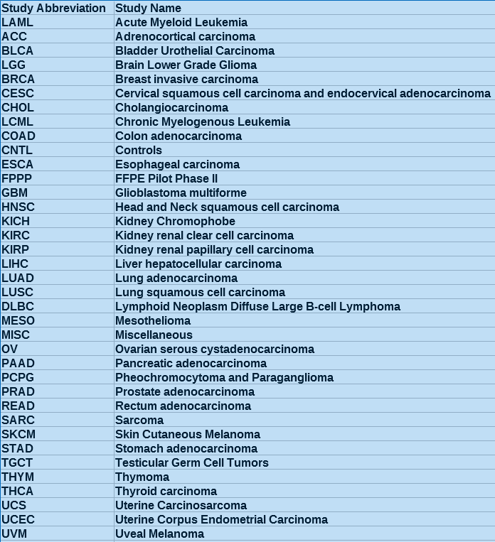

# Tumor Classification and finding possible Biomarkers by Machine Learning using Gene Expression Data 
---
## Abstract

An overview of applying ML techniques for tissue of origin prediction on TCGA RNA-Seq data. 
This analysis includes exploring, visualizing and clustering the gene expression data by principal component analysis (PCA), t-distributed Stochastic Neighbor Embedding (t-SNE) and hierarchically-clustered heatmap. The analysis also includes code for cancer classification by using supervised machine learning on gene expression data.    

## Data
The RNA-seq has become the dominant method studying gene expression in the filed of cancer genomis. Large amount of gene expression data are available, e. g. [The Cancer Genome Atlas (TCGA) ](https://www.cancer.gov/about-nci/organization/ccg/research/structural-genomics/tcga). The data contains around 10,000 expression levels of about 20,000 genes, and labels of 32 different cancer types.

## Analysis Overview
The data was first explored and lableled by clinical data  

Applying PCA dimensionality reduction before clustering  

Applying t-SNE for clustering and visualization  

Classification and dimentionality reduction by XGBoost modeling  

More dimensionality reduction to explore possible biomarker  

Hierarchically-clustering, and visualizing the result using a heatmap on reduced gene set  

### The data was first explored and labeled by clinical data
Label the samples by clinical data and keeping cancer types with at least 30 samples  

### Applying PCA dimensionality reduction before clustering
Since t-SNE is computationaly expensive we use PCA and keep subset of PCs (1000) instead of all 20K genes that preserve majority of variation in data   

### Applying t-SNE for clustering and visualization
Visualization of hidden clusters in data in lower dimension  

### Classification and dimentionality reduction by [XGBoost](https://xgboost.readthedocs.io/en/latest/) modeling
Using expression of all 20K genes as inputs to the model and cancer types as outputs  
Confusion matrix of the test set (30% of the data)  
Accuracy: ttaining 100% testing > 96% 
misclassifications of the model are primarily within the same organ systems, e.g. colon(COAD) and rectal (READ)  

### More dimensionality reduction to explore possible biomarker
Using features with non-zero importance coefficients for further dimensioality reduction  
Only using expression of 200 genes can result more than 95% accuracy in cancer type prediction  
Plotting confusion matrix to show the performance of our model

### Hierarchically-clustering, and visualizing the result using a heatmap on reduced gene set
Vertical bar shows the classification power of the model and clusters in heatmap shows possible biological mechanisms for different cancer types  

